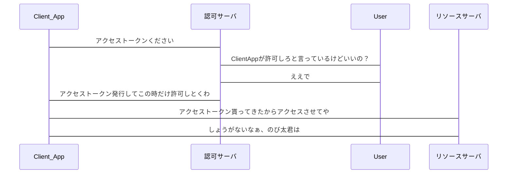

<!-- headingDivider: 1 -->

<!-- #　見出しの前にスライドページを自動的に分割 -->

# エンジニアMTGのゴール

以下の問に回答できる

- OAuth2.0のスコープとは？

- Authorization Code は何の証か

- OAuth2.0使用したWebApplicationの場合どのフロー採用するのが最適か？

  

# アジェンダ

1. OAuthとは？
2. OAuthの登場人物について
   1. リソースオーナ
   2. クライアント
   3. リソースサーバ
   4. 認可サーバ
   5. 各ロールの関係性
3. OAuthのトークン
4. OAuthのフロー

# OAuthとは？

- 以下はRFC 5849に記載されているOAuth2.0に基づいた記載です。
  - HTTPサービスへの限定的なアクセスを可能にする認可フレームワーク
  - リソースオーナーとHTTPサービスの間で同意のためのインタラクション

# OAuthのロール

# OAuthのロール

OAuthのロール（役割）は以下に分けられます

1. リソースオーナ
2. クライアント
3. リソースサーバ
4. 認可サーバ

# リソースオーナ (resource owner)

- 保護されたリソースへのアクセスを許可するエンティティ. 

- リソースオーナーが人間の場合, エンドユーザーと呼ばれる

e.g.

- Google photoとか

- Twitterのアカウントの連携とか

# リソースサーバ (resource server)

- アクセストークンを用いた保護されたリソースへのリクエストを受理してレスポンスを返すことのできるサーバ

e.g.

- Google photoとか

- Twitterのアカウントの連携とか

# クライアント (client)

- RO(リソースオーナ)の認可を得て,**ROの代理として**保護されたリソースに対するリクエストを行うアプリケーション
- OAuthクライアントは該当アプリケーションの実装上の特徴には関係がないです

e.g.

- サーバアプリケーション
- デスクトップアプリケーション
- その他のデバイスアプリケーション

# 認可サーバ (authorization server)

- ROの認証とROからの認可取得が成功した後, アクセストークンをクライアントに発行するサーバ

e.g.

- Google Account Login

# 各ロールの関係性

sequenceDiagram
participant Client_App
participant 認可サーバ
participant User
participant リソースサーバ
Client_App->認可サーバ:アクセストークンください
認可サーバ->User:ClientAppが許可しろと言っているけどいいの？
User->認可サーバ:ええで
認可サーバ->Client_App:アクセストークン発行してこの時だけ許可しとくわ
Client_App->リソースサーバ:アクセストークン貰ってきたからアクセスさせてや
リソースサーバ->Client_App:しょうがないなぁ、のび太君は

<!-- mermaid.js -->

# 各ロールの関係性

# OAuthのトークンその1

- response_type
  - 必須 (REQUIRED). 値は必ず `code` にしなければならない (MUST).
- client_id
  - 必須 (REQUIRED). クライアントが提供した登録情報を表すユニーク文字列
- redirect_uri
  - 任意 (OPTIONAL).リソースオーナーとのやりとりが完了した後, 認可サーバーはリソースオーナーのユーザーエージェントをクライアントへ誘導する. 

# OAuthのトークンその2

- scope
  - 任意 (OPTIONAL).  クライアントは `scope` リクエストパラメーターを用いて要求するアクセス範囲を明示することができる.
- state
  - 推奨 (RECOMMENDED).事実上必須クエストとコールバックの間で状態を維持するために使用するランダムな値

# OAuthのフロー

- 認可コード
- インプリシット
- リソースオーナパスワードクレデンシャル
- クライアントクレデンシャル
- リフレッシュトークン